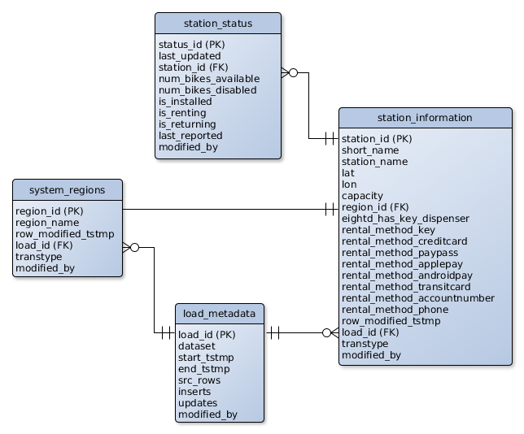

# Bikeshare Data
This repository currently contains the source for an ETL/CDC pipeline for Capital Bikeshare data. Data is pulled from the Bikeshare API, and loaded into a Postgres database. The database is currently made up of two dimension tables and one fact table. The dimensions are very slow changing, so are batch loaded twice a day. The fact table is generally updated in ten second intervals, so it is loaded with a streaming CDC process.

More information about the General Bikeshare Feed Specification can be fund [here](https://github.com/NABSA/gbfs/blob/master/gbfs.md). More information about the Capital Bikeshare system can be found [here](https://www.capitalbikeshare.com/). 

## Table of Contents
- [The Database](#the-database)
- [Processing](#processing)
- [Mysteries](#mysteries)
- [Copyright and License](#copyright-and-license)

## The Database

### Dimensions
Dimension tables share the following metadata attributes:

| Column			| Datatype		| Description											|
| ----------------- | ------------- | ----------------------------------------------------- | 
| row_modified_tstmp| datetime  	| The timestamp when the row was inserted or updated. 	|
| load_id			| int 			| Foreign key to the load_metadata table with more information about the load process that included this record.|
| transtype			| char(1)		| Character denoting transformation. Right now only I or U (insert or update). |
| modified_by		| varchar(50) 	| Postgres user name of user who inserted or updated the record. |

#### System Regions
The system_regions table contains data about the different regions of the bikeshare system. Regions like Alexandria, Washington DC, etc. Regions records have a unique int ID and name. That's it, the rest is all dimension metadata. It has a foreign key connection to load_metadata which will show more details about the load.

#### Station Information
The station_information table describes each station in the system. The table gives the name and ID of the station, as well as the lat/lon location, capacity of bikes, what region it's in, and what type of payment it accepts. It has region_id as a foreign key which connects it to system_regions. It also has load_id as a foreign key for the load_metadata table.

### Fact Table
#### Station Status
This fact table is frequently updated with the latest status of each station. Whenever a bike is checked out or returned from a station, that change should be reflected in this table. Along with how many bikes are available, the table also shows how many bikes are disabled, and the status of station. status_id is an auto_generated primary key. station_id is a foreign key that connects it to station_information. There is also a unique constraint on the last_updated and station_id columns.

## Processing
ETL processing on the dimensions is fairly straightforward. The API data is read in, and compared against the database data. If a record is new, it is inserted. If a record has changed, it is updated. These are slow changing dimensions. Currently, historical data is not kept.

The CDC on the station_status table is a bit more complicated. API data for this table is usually updated in ten second intervals. In that time, any amount of records (from none to all) can be updated. To minimize noise and storage space, only updated records are added to the database. To minimize database pulls, the process only gets the database data when it starts up. As the API data is pulled and compared, the latest data is held in memory. As the new records are added to the database, they are also updated in the local collection. Once a comparison and load is complete, the process sleeps for the TTL from the file (usually 10 seconds), and then gets the next file and compares again.

## Mysteries
Do you know what *eightd_has_key* means? If you can tell me, I'll give you a $12 giftcard to Applebees Neighborhood Grill and Bar™. 

## Copyright and License
Copyright 2017 [Carlos Torres](http://carlostorres.codes). Code release under the MIT license.